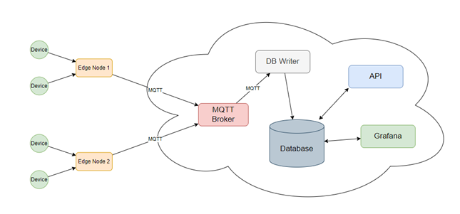

# Monitoring system
This is repository for temperature and humidity data monitoring system project.
This project consists of many different parts that are described below.

## Edge clients
Edge clients are programs to collect metrics from sensor and send them to server by MQTT protocol.  
There are two clients:
* C client (fast)
* Python client (slow)

## TimescaleDB
Timescale Database is used to store time-series data.

## Mosquttio MQTT Broker
Mosquitto is used as MQTT Broker to receive messages from edge clients.

## DB Writer
This component is used to write messages from broker to database.

## Grafana
Grafana is used to visualise measurements.

## API
API is used to control main system objects.
Api Methods:
* POST /device
* POST /stations
* GET /stations
* GET /stations/{station_id}
* GET /stations/{station_id}/info
* GET /devices/{device_id}/data?daysago=\<value\>

## Nginx
Access to some components is controlled by nginx which is configured as reverse proxy.

## Docker and Kubernetes
All components can be used as Docker containers. They were also configured as Kubernetes Pods so they also can be used in Kubernetes Cluster.